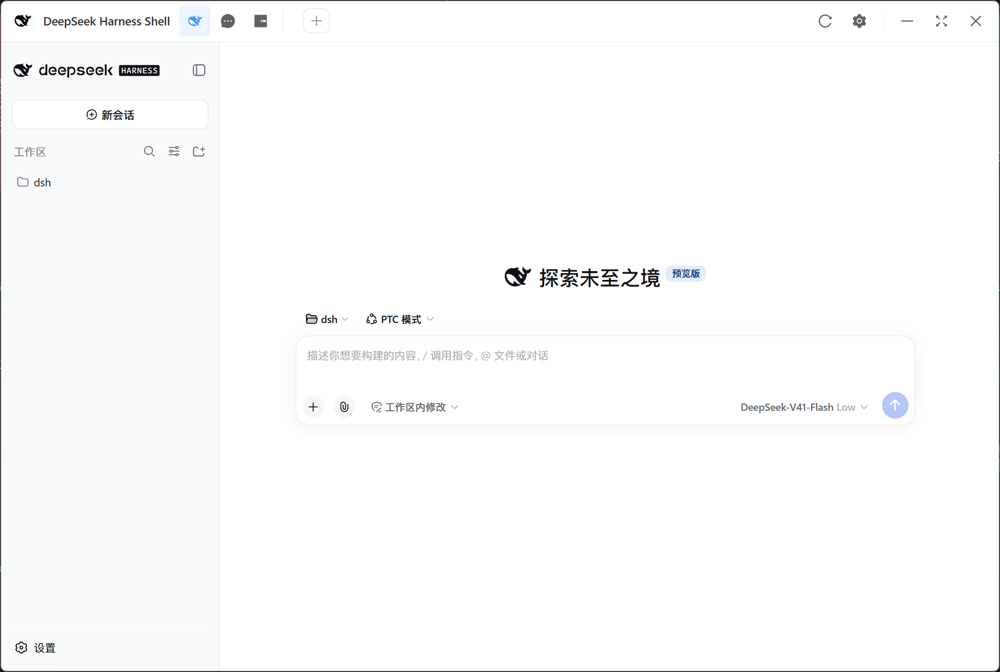

<div align="center">

# DeepSeek Harness Shell

**把 DeepSeek Harness 装进桌面：双击就能用，不用命令行、不用自己配环境。**

[](https://www.electronjs.org/)
[](https://vuejs.org/)
[](LICENSE)
[](#)

</div>



> 上图就是打开后的样子：顶部是浏览器式标签栏，左侧是工作区与会话，中间可以直接对话。

---

## 这是做什么的？

DeepSeek Harness（下面简称 **dsh**）原本是一个需要在命令行里启动、再用浏览器打开的程序。对不熟悉命令行的用户来说，光是「装 Node、装内核、记住启动命令」就足够折腾。

**DeepSeek Harness Shell 就是它的桌面版入口**：在后台帮你启动 dsh，并把界面直接嵌进一个原生窗口。你只要双击图标，剩下的交给它。

它不替代 dsh，只是把「启动 dsh」这件事变成点一下按钮。

## 三步就能用

### 第 1 步：下载安装

打开 [Releases](../../releases) 页面，下载对应你系统的安装包：

| 系统 | 下载哪个 |
|---|---|
| Windows | `...-win-x64-setup.exe`（ARM 机器选 `arm64`） |
| macOS | `...-mac-arm64.dmg` 或 `...-mac-x64.dmg` |
| Linux | `...-linux-x64.AppImage` |

双击安装或打开。如果系统提示「未知发行者」，按提示放行即可（开源应用通常没有付费签名）。

### 第 2 步：首次启动，跟着向导点

第一次打开会自动弹出**安装向导**，一共四步，每步点「执行并下一步」：

| 步骤 | 你会看到 | 拿不准怎么选？ |
|---|---|---|
| 1. 镜像源 | 官方源 / npmmirror 镜像 | 国内选 **npmmirror**，更快 |
| 2. Node 环境 | Electron 自带 / 系统自带 / 本地部署 | 本机没装 Node 就选 **本地部署** 或 **Electron 自带** |
| 3. npm 环境 | 程序内置 / 系统自带 / 本机 Node 自带 | 选 **程序内置** 最省心 |
| 4. 安装内核 | 版本下拉框 + 安装按钮 | 直接用默认版本，点安装 |

下载与解压随时可以取消；想装别的版本，在下拉框里挑即可。安装完成后应用会自动启动，看到主界面就成功了。

### 第 3 步：开始使用

- 在左侧「工作区」里选择或打开一个文件夹；
- 点「新会话」，在中间输入框里描述你想做的事；
- 一切都在本机运行（默认只监听 `127.0.0.1`）。

---

## 术语小抄

不确定下面这些词是什么意思的话，看这张表：

| 名词 | 白话解释 |
|---|---|
| **dsh / 内核** | 真正干活的 DeepSeek Harness 程序，相当于「引擎」 |
| **Node / npm** | 引擎运行需要的零件；本应用可以帮你自动下载，不用自己装 |
| **配置目录** | 应用存放自己数据的位置，默认 `~/.dsbox/release`（开发版为 `~/.dsbox/dev`） |
| **工作区** | dsh 读写文件时所在的文件夹 |
| **全局安装** | 装在整个系统里的 dsh；如果你本来就有，也可以让本应用直接用它 |

---

## 它能帮你做什么

- **一键运行内核**：自动定位 / 安装 / 启动 / 停止 / 重启 dsh，窗口与内核同生共死，退出不残留后台进程。
- **版本化安装与切换**：Node、npm、内核都按版本号分开存放，可并存、可切换、可删除；装错了能退回旧版本，也可在「设置 → 环境 / 内核」里操作。
- **环境自给**：可选内置 Node + 内置 npm，系统里什么都没装也能跑；也能探测已有的系统 Node（要求 ≥ 20）。
- **多线程下载**：显示实时速度与文件大小，同一文件不会重复下载，下载与解压都可随时取消。
- **浏览器式标签页与多窗口**：内核界面 / 网页对话 / 用量充值三个固定标签 + 动态标签，可拖动排序、可在新窗口打开。
- **应用自更新**：后台下载新版本，保留上一版可一键回退；新版连续启动失败还会自动回退。
- **配置目录可迁移**：在设置里更换目录，重启后自动搬过去，并显示迁移进度与当前文件。
- **界面可调**：主题 / 深色、界面缩放、中英双语，另有二次元、文言、繁体中文等扩展翻译。

---

## 界面速览

- **顶部标题栏**：左侧是应用名；中间是标签栏——蓝色高亮的 **DeepSeek UI**（内核界面）、网页对话、充值平台等标签，右侧 `＋` 可新开标签；最右侧是刷新、设置、最小化 / 最大化 / 关闭。
- **主区域（内核界面）**：左侧竖栏是 DeepSeek Harness 标识、「新会话」按钮和「工作区」列表；中间是欢迎语、工作区 / 模式选择、输入框与模型选择；左下角是「设置」。
- **设置页**以覆盖层打开，覆盖在网页之上，切回来仍是原来的状态；终端也收在设置里，按 `Ctrl/Cmd + T` 可快速切换。

更完整的说明见 [界面与操作](docs/zh/user/usage.md)（[English](docs/en/user/usage.md)）。

---

## 常见问题

<details>
<summary><b>我本机没装 Node，能用吗？</b></summary>

能。向导里 Node 环境选「本地部署」或「Electron 自带」，npm 选「程序内置」，应用会自动下载所需零件。

</details>

<details>
<summary><b>安装卡住 / 下载很慢怎么办？</b></summary>

打开「设置 → 网络」，把 npm 镜像源切到 `npmmirror`，必要时再配置代理；下载并发数也可以在同一页调整。

</details>

<details>
<summary><b>我想用自己全局安装的 DeepSeek Harness</b></summary>

「设置 → 内核 → 内核来源」选「全局」，再用文件选择器指定启动器路径。

</details>

<details>
<summary><b>界面想换个风格 / 语言</b></summary>

「设置 → 外观」里可切换主题与配色；「语言」的二级下拉还能选二次元、文言、繁体中文等扩展翻译（只改本应用的文案，不动 dsh 数据）。

</details>

<details>
<summary><b>关掉窗口后 dsh 还在后台跑吗？</b></summary>

默认关闭到系统托盘；真正退出应用时会一并结束它管理的 dsh，不会留下残留进程。

</details>

<details>
<summary><b>更新会不会把旧版本弄丢？</b></summary>

应用自更新会先把当前版本压缩归档一份，「设置 → 关于」可一键回退；新版连续启动失败也会自动回退。

</details>

---

## 从源码运行（进阶，可跳过）

适合想自己改代码的人，需要 Node ≥ 20：

```bash
git clone https://github.com/XEonSKY/DeepSeek-Harness-Shell.git
cd DeepSeek-Harness-Shell
npm install
npm run dev
```

常用命令：`npm run typecheck`、`npm run lint`、`npm run build`、`npm run docs:dev`。

---

## 更多

- 在线文档：[简体中文](https://dssh.xeonsky.com/zh/) · [English](https://dssh.xeonsky.com/en/)
- 文档源码：用户文档 [`docs/zh/user/`](docs/zh/user/) · 开发文档 [`docs/zh/dev/`](docs/zh/dev/)（英文见 `docs/en/`）
- 遇到问题：[Issues](../../issues)

---

<div align="center">

**如果这个项目对你有帮助，欢迎点个 Star；遇到问题可以开 Issue。**

</div>
